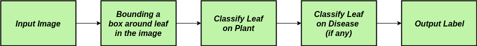
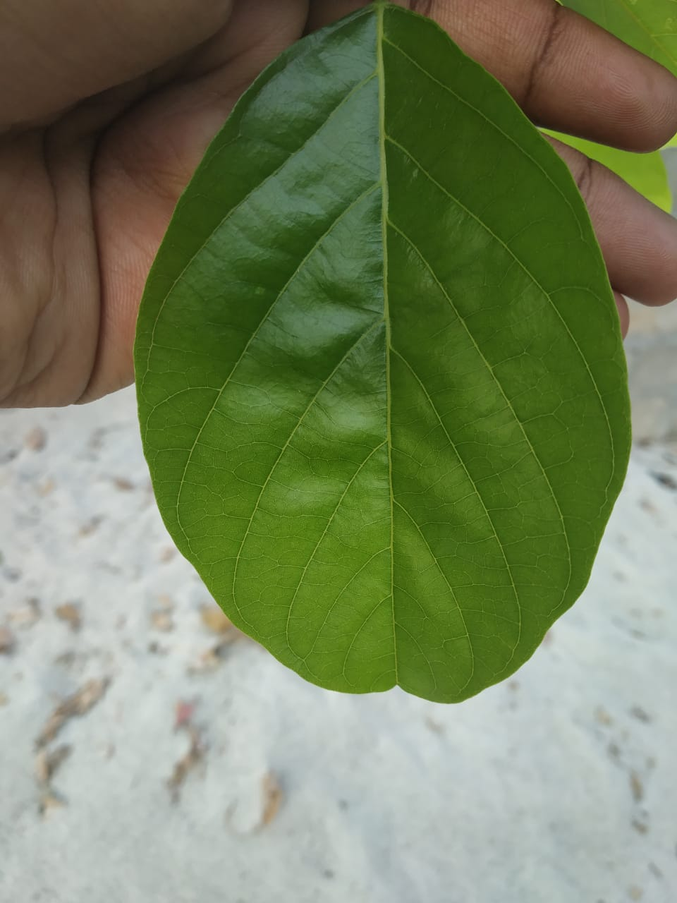
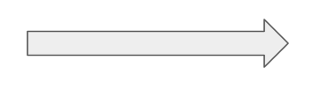
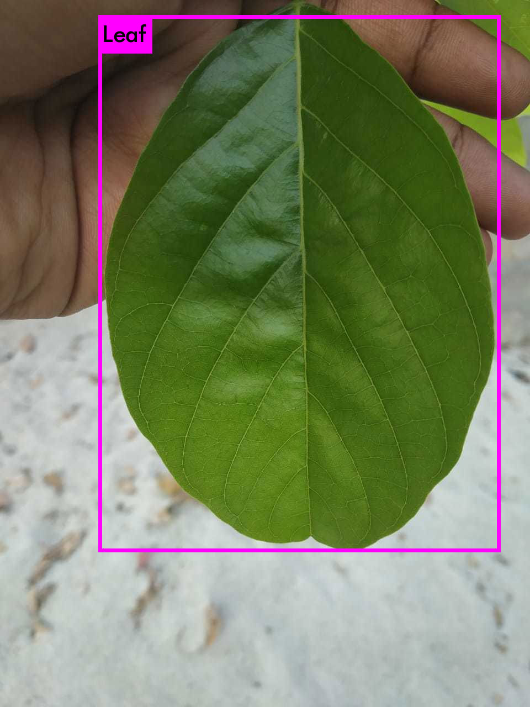
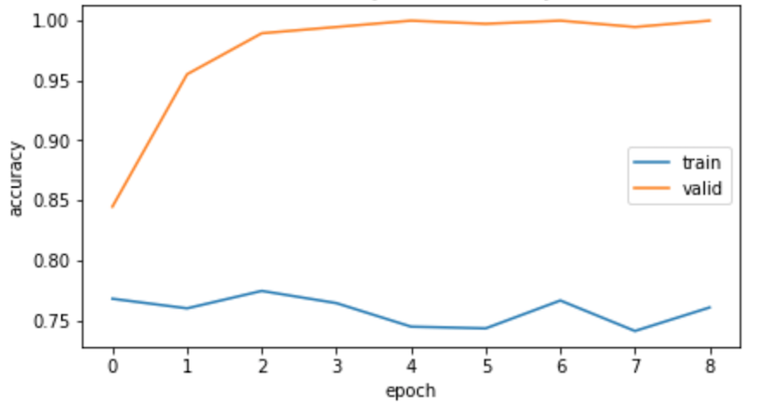

# Leaf-Disease-Classifier

* Leaf Disease Classifier classifies disease based on image processing techniques for automated vision system used at agricultural field. 

* Check out my resreach paper : deepakhonakeri.ml/static/docs/Research_paper_IJCSE.pdf

* The classifier is trained on the dataset found at
   * https://www.kaggle.com/emmarex/plantdisease
   * https://github.com/spMohanty/PlantVillage-Dataset
    

# Deep Dive into Concepts
- [Disease Classifier](##DiseaseClassifier)
- [How To Train](##HowToTrain)
- [Run Model](##RunModel)

## Disease Classifier

The whole disease classification process is divided into 3 stages as in 

- An input image is initially taken, A You Only Look Once (YOLOv3), object detector is run over the input image to obtain the coordinates of bounding boxes around leaves present in the image if any. The detector divides the input image into a grid and then analyzes every cell to identify features of the target object. The adjacent cells where the features are detected with high confidence are then put together to produce the output of the model.

 
 

- The leaves are then cropped out of the image using the OpenCV library using the given coordinates from the bounding boxes. These extracted images are passed as input to a CNN Classifier which classifies the input into the 8 classes of plants from the dataset. 

    
- 8 CNN classifiers are trained to identify the diseases of each of the 8 plant classes.  The result from stage 2 is used to call the classifier that has been trained to classify the different diseases for that plant. If there are none, the leaf would be classified as 'Healthy'.

- All the above CNN's are trained on a Deep Residual Network- ResNet-50 Architecture using "Transfer Learning" from the ImageNet weights.

[//]: # ()

- Frameworks used : Keras, DarkNet.

# How-To-Train:

<b> Check the "how_to_train" folder for detailed explanation on getting started and how to train the each of the models (explained in the next section) are trained.</b>

Find it here : https://github.com/deepakHonakeri05/Leaf-Disease-Classifier/tree/master/how_to_train

## Run Model

- To run and setup the model, you’ll need at least OpenCV 3.4.2.
- Dataset structure used in the project :
     * git clone https://github.com/deepakHonakeri05/yolo_dataset.git
- The weights of the networks can be given on-demand due constraints set on GitHub. 

## About me

**Piyush Pathak**

[**PORTFOLIO**](https://anirudhrapathak3.wixsite.com/piyush)

[**GITHUB**](https://github.com/piyushpathak03)

[**BLOG**](https://medium.com/@piyushpathak03)

# 📫 Follw me: 

